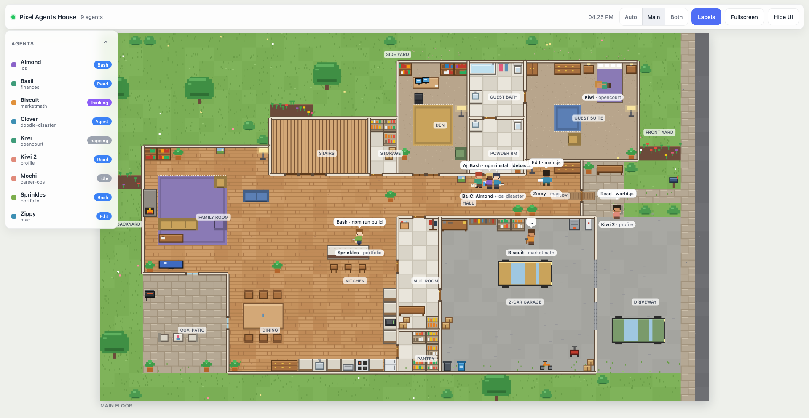
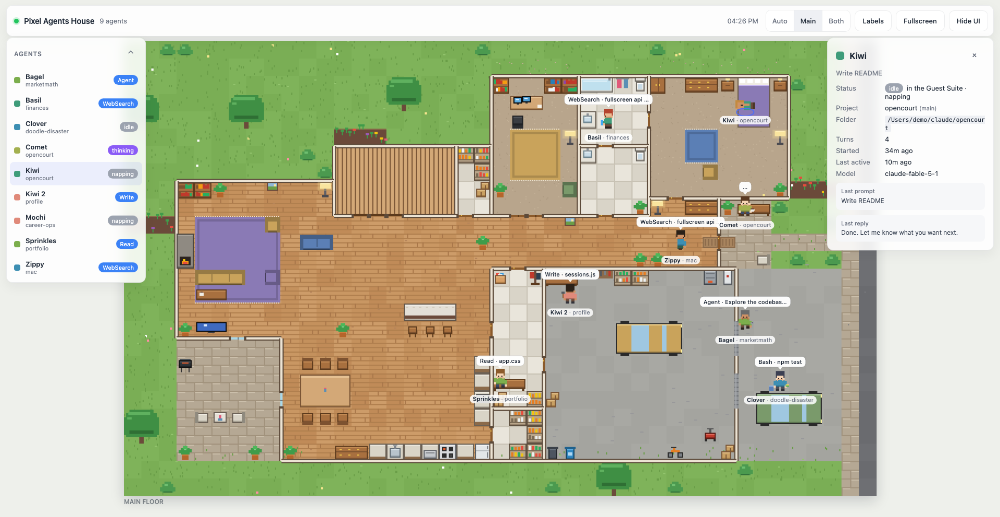
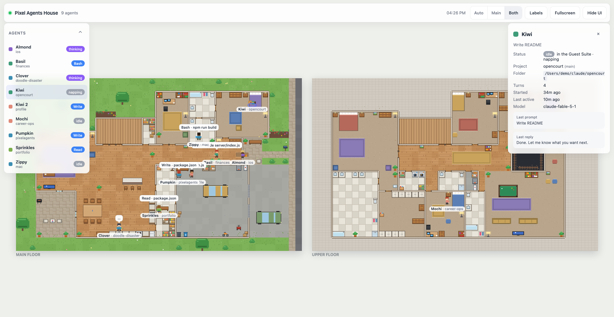
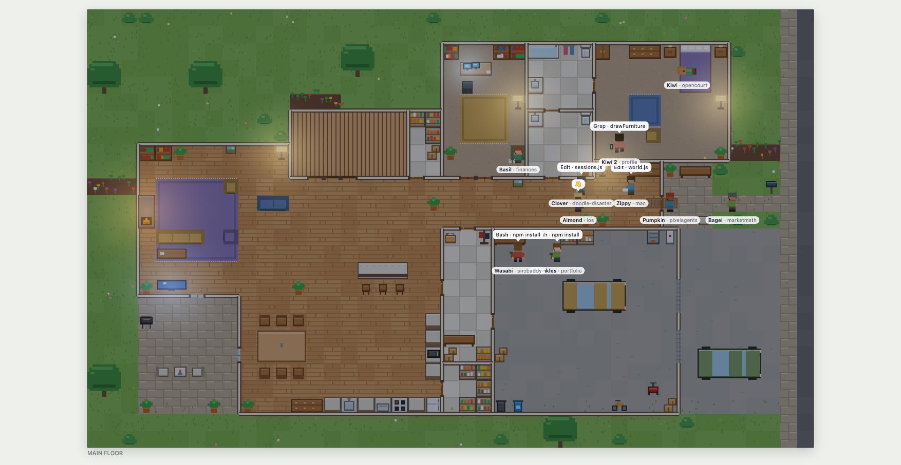

# Pixel Agents House

[](https://kbrovibes.github.io/pixel-agents-house/app/?demo=8&labels=1)
[](https://kbrovibes.github.io/pixel-agents-house/)
[](LICENSE)




Every live [Claude Code](https://claude.com/claude-code) session becomes a pixel-art character living in your house. Agents that are reading code sit at a desk, agents that are editing cook dinner, agents running shell commands mow the lawn or take out the trash. Idle agents rest on the couch, sleepy ones nap in a bed, and sessions that end walk out the front door. It runs full-screen in any browser, is reachable from every device on your wifi, and has no build step.

The house is the Greenville 4868B plan (main floor + upper floor). The upper floor appears automatically when the main floor gets crowded.

## Requirements

- Node.js 18 or newer.
- Claude Code writing transcripts to `~/.claude/projects` (this is the default; nothing to configure, no hooks to install).

This app only *reads* transcript files, so it coexists with the original Pixel Agents extension or CLI if you already run one.

## Quick start

```bash
npm install
npm start
```

Open <http://localhost:4321>. Start a Claude Code session anywhere and a character walks in through the front door.

- Full screen: press `F` or click the Fullscreen button.
- Kiosk mode (hides all UI chrome until the mouse moves): <http://localhost:4321/?kiosk=1>.
- No sessions running? Try `npm run demo` for ten fake agents.

### One command install (macOS)

```bash
npm run install-app
```

This registers a launchd agent that starts the server at login and keeps it alive, serves on port 80, and
advertises the name **pixelagents.local** on your wifi through Bonjour. From then on, on the Mac and on any
phone, tablet or laptop on the same network, just open:

**<http://pixelagents.local>**

Options: `npm run install-app -- --name house --port 8080` → `http://house.local:8080`. Remove everything with
`npm run uninstall-app`. Logs go to `~/Library/Logs/pixel-agents-house.log`. If macOS asks whether `node` may
accept incoming connections, allow it. Windows devices need Bonjour (bundled with iTunes) to resolve `.local` names.

URL parameters, handy for a monitor that is always on:

| Parameter | Effect |
| --- | --- |
| `?kiosk=1` | Hide the UI chrome; it reappears while the pointer moves |
| `?floors=auto` / `?floors=main` / `?floors=split` | Auto shows the main floor edge to edge and, while someone is upstairs, cycles between the floors (10 s main, 5 s upper) with the other floor as a picture-in-picture inset. Split shows both side by side |
| `?labels=1` | Room labels on |
| `?night=1` / `?night=0` | Force night or day lighting (default follows the clock: night before 06:30 and after 19:30) |

Example for a wall monitor: <http://localhost:4321/?kiosk=1&labels=1>

## Access from any device on the wifi

The server binds `0.0.0.0`, so it is reachable from every device on the same network. On startup it prints every URL it is listening on, for example:

```
Pixel Agents House
  local    http://localhost:4321
  network  http://10.0.0.157:4321
  bonjour  http://Karthiks-MacBook-Air.local:4321
```

- **Find your IP** on macOS: `ipconfig getifaddr en0` (Wi-Fi) or `ipconfig getifaddr en1`.
- **Bonjour name**: `http://<your-hostname>.local:4321` works from Apple devices and most others without knowing the IP. Your hostname is `hostname` in a terminal.
- **macOS firewall**: the first time you start the server macOS may ask whether `node` can accept incoming connections. Click Allow. If you dismissed it, enable node under System Settings → Network → Firewall → Options.
- **iPad / iPhone full screen**: open the URL in Safari, tap Share → Add to Home Screen. The saved icon launches without an address bar.
- **Install as an app (Chrome / Edge)**: the page is a PWA. Click the install icon at the right end of the address bar, or the **Install** button in the top-right toolbar when the browser offers it. Chrome only installs from `http://localhost` or an `https://` origin, so from another device use the HTTPS address after trusting the CA once (next section). The installed app keeps working offline from the last snapshot until the server is back.
- **Monitor kiosk**: open the kiosk URL in a browser, press `F`.

### HTTPS and installing from an iPad or another device

Browsers only treat `http://localhost` as secure, so the offline service worker and Chrome's install prompt need HTTPS everywhere else. The server therefore also listens on HTTPS (port 443 when the HTTP port is 80, otherwise the HTTP port plus one; override with `PA_TLS_PORT`, disable with `PA_TLS=0`). On first start it creates a local certificate authority in `~/.pixelagents/tls` and issues a certificate for `localhost`, `<name>.local`, your hostname and your LAN IP, re-issuing automatically when those change. Each device has to trust the CA once:

1. **iPad / iPhone**: open `http://pixelagents.local/ca.crt` in Safari and allow the download. Settings → Profile Downloaded → Install. Then Settings → General → About → Certificate Trust Settings → enable full trust for *Pixel Agents House Local CA*. Open `https://pixelagents.local`, Share → Add to Home Screen.
2. **Mac (Chrome / Safari)**: `security add-trusted-cert -r trustRoot -k ~/Library/Keychains/login.keychain-db ~/.pixelagents/tls/ca.crt`, then restart the browser and open `https://pixelagents.local`. Chrome shows the install icon in the address bar.
3. **Android**: download `http://pixelagents.local/ca.crt`, then Settings → Security → Encryption & credentials → Install a certificate → CA certificate.
4. **Windows**: download the file, double-click → Install Certificate → Local Machine → Trusted Root Certification Authorities.

Only devices with the CA installed will trust the address. Deleting `~/.pixelagents/tls` starts over with a new CA, which every device would need to trust again.

### Run it permanently

Simplest: keep it in a tmux session.

```bash
tmux new -d -s pixelagents 'cd ~/claude/pixelagents && npm start'
```

Or let launchd start it at login and restart it if it dies. Find your node path with `which node` (Homebrew Apple Silicon is `/opt/homebrew/bin/node`), then save this as `~/Library/LaunchAgents/com.pixelagents.house.plist`, fixing the two paths:

```xml
<?xml version="1.0" encoding="UTF-8"?>
<!DOCTYPE plist PUBLIC "-//Apple//DTD PLIST 1.0//EN" "http://www.apple.com/DTDs/PropertyList-1.0.dtd">
<plist version="1.0">
<dict>
  <key>Label</key><string>com.pixelagents.house</string>
  <key>ProgramArguments</key>
  <array>
    <string>/opt/homebrew/bin/node</string>
    <string>server/index.js</string>
  </array>
  <key>WorkingDirectory</key><string>/Users/YOU/claude/pixelagents</string>
  <key>EnvironmentVariables</key>
  <dict><key>PORT</key><string>4321</string></dict>
  <key>RunAtLoad</key><true/>
  <key>KeepAlive</key><true/>
  <key>StandardOutPath</key><string>/tmp/pixelagents.log</string>
  <key>StandardErrorPath</key><string>/tmp/pixelagents.err</string>
</dict>
</plist>
```

```bash
launchctl load ~/Library/LaunchAgents/com.pixelagents.house.plist    # start now and at every login
launchctl unload ~/Library/LaunchAgents/com.pixelagents.house.plist  # stop
```

## Configuration

All settings are environment variables.

| Variable | Default | Meaning |
| --- | --- | --- |
| `PORT` | `4321` | HTTP + WebSocket port |
| `HOST` | `0.0.0.0` | Interface to bind. Use `127.0.0.1` to keep it local only |
| `PA_PROJECTS_DIR` | `~/.claude/projects` | Where Claude Code writes transcripts |
| `PA_IDLE_TIMEOUT_MIN` | `20` | Minutes without transcript activity before a session is considered ended and its agent leaves |
| `PA_DEMO` | unset | Number of fake agents to simulate instead of reading transcripts (`npm run demo` sets 10) |
| `PA_DEMO_FAST` | unset | With `PA_DEMO`, cycle fake activity every few seconds |
| `PA_HOSTNAME` | unset | Advertise `http://<name>.local` on the LAN via Bonjour (macOS). `npm run install-app` sets this |
| `PA_DETAIL` | `task` | What the browser gets to see. `task` shows only what kind of work is happening (editing, running a command…) plus the tmux session name; `full` also sends file names, commands, the last prompt and the last reply |
| `PA_INCLUDE_HEADLESS` | unset | Set to `1` to also show headless `claude -p` sessions (SDK / observer runs). Hidden by default because they are usually not interactive work |

## Controls

| Input | Action |
| --- | --- |
| `F` | Toggle fullscreen |
| `H` | Hide / show the UI chrome |
| `L` | Toggle room labels |
| `1` / `2` / `0` | Main floor only / both floors side by side / auto (edge-to-edge with picture-in-picture cycling when the upper floor is in use) |
| `Esc` | Deselect agent, close details panel |
| Click or tap a character | Select it and open its details (project, branch, current tool, last prompt, last reply, tool counts) |
| Roster rows | Same as clicking the character |
| Top-right buttons | Floors, Labels, Fullscreen, Hide UI (all work with touch) |
| Legend (bottom-left) | Live counts, context-window usage (average and peak, against the 200k or 1M window), tool calls in the last five minutes, helpers, tmux sessions, and a quiet ticker of arrivals and departures |

## How it works

1. `server/sessions.js` tails every `*.jsonl` transcript under `~/.claude/projects` (plus subagent transcripts) and derives a status per session: `working` (a tool call is in flight), `thinking` (the model is generating), `idle` (waiting for you) or `gone` (no activity for `PA_IDLE_TIMEOUT_MIN`).
2. The tool in flight maps to an activity (`read`, `write`, `bash`, `web`, `agent`) and is pushed to browsers over a WebSocket.
3. The browser maps activities to chores and chores to stations in the house: the stove for cooking, the mailbox for checking mail, the lawn for mowing. Agents path-find through doors and up the stairs.
4. Main-floor stations are used first. When they fill up, agents climb the stairs and the upper floor is rendered next to the main floor.
5. Idle agents never do chores: they sit, sip coffee, or nap. Subagents appear as smaller helpers in the parent's colours.

More detail:

- [docs/CHORES.md](docs/CHORES.md): which tool sends an agent to which chore, and the idle / nap / thinking rules.
- [docs/FLOORPLAN.md](docs/FLOORPLAN.md): how the house was digitised and how to model your own.
- [docs/ARCHITECTURE.md](docs/ARCHITECTURE.md): module layout, wire protocol, and the API contract between files.

## Troubleshooting

- **No agents in the house.** Start a Claude Code session; the character appears after its first message. If Claude Code writes transcripts somewhere unusual, set `PA_PROJECTS_DIR`. Sessions older than `PA_IDLE_TIMEOUT_MIN` are ignored on startup. `npm run demo` proves the front end works.
- **`EADDRINUSE` on start.** Something else is on port 4321. Run `PORT=4400 npm start`.
- **Phone or iPad can't connect.** Both devices must be on the same wifi (guest networks usually isolate clients). Turn off VPNs on either side. Check the macOS firewall allowed `node`. Use the IP URL printed at startup rather than `localhost`.
- **iPad shows the address bar in fullscreen.** Use Add to Home Screen; Safari's fullscreen API is limited.
- **Characters stand around after I stop Claude Code.** Ended sessions leave after `PA_IDLE_TIMEOUT_MIN` of silence because Claude Code does not always write an end marker. Lower the timeout if you prefer.

## Roadmap

- In-browser floor plan editor (draw your own rooms, doors and furniture).
- Custom sprites and palettes.
- Optional sounds.

## License

MIT, see [LICENSE](LICENSE).

## Screenshots

| Idle means idle | Both floors | Night, kiosk mode |
| --- | --- | --- |
|  |  |  |

## Links

- Project page: <https://kbrovibes.github.io/pixel-agents-house/>
- Live demo (simulated sessions, runs entirely in the browser): <https://kbrovibes.github.io/pixel-agents-house/app/?demo=8&labels=1>
- More weekend projects: <https://kbrovibes.github.io/> · Portfolio: <https://karthikrajan.info>
